# 第八章 计算机组成与体系结构

> 本章概述
>
> - 编码及浮点数运算 ※※
> - Flynn分类法 ※※
> - CISC与RISC ※※
> - 存储系统 ※※※※※
> - 嵌入式系统 ※※※
> - 系统可靠性计算 ※※

## 一、浮点数运算

### 1.1浮点数定义

> 把小数点左边（即整数）的位宽和小数点右边（即小数）的位宽固定，这就是一个**定点数。**
>
> 如果我愿意把小数部分的位宽分给整数，或者相互分享，比如我可以20位放在整数，12位放小数，在运算过程中，小数点左右的位宽可以一直变换。这就好比小数点在32个bit中浮动，这样的计算就叫**浮点运算。**
>
> - 浮点运算有什么好处呢？对于32位宽来说，它支持最大的数是2^32，支持最小的精度是2^(-32)。这就比定点数的在同样位宽的情况下表达力更强了。

[原码、反码、补码和移码其实很简单](https://blog.csdn.net/liushuijinger/article/details/7429197)

[程序员必知之浮点数运算原理详解](https://blog.csdn.net/tercel_zhang/article/details/52537726)

BiliBili视频：[浮点数的表示与运算-运算](https://www.bilibili.com/video/av50160161/?p=1)

- 表示格式：尾数*基数^指数
- 实例：
  - -5/256转换为：
  - -0.101×2^-101
  - **尾数是二进制表示，指数也是二进制表示**

**加减运算顺序：**

- 真值到机器数的转换
- 对阶：使两个数的阶码相等，小阶向大阶看齐，尾数每右移一位阶码加1
- 尾数加减：位数是二进制数例如59转换为尾数111011
- 规格化：右移或补码
- 舍入
- 溢出判断

## 二、计算机体系结构分类-Flynn分类法

[【整理】SISD、MIMD、SIMD、MISD计算机的体系结构的Flynn分类法](https://blog.csdn.net/conowen/article/details/7256260)

[计算机体系结构](https://www.iambigboss.top/post/25730_1_1.html) 

#### **总结**

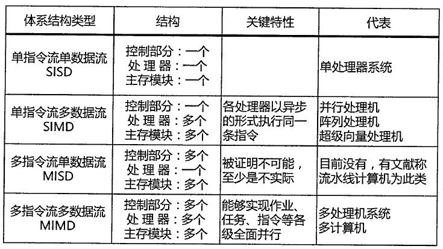

- **维度**
  - 指令流
  - 数据流
- **结构**
  - 控制部分数量对应指令流数量
  - 处理器数量对应数据流数量
  - 控制部分、处理器数量对应主存模块数量

##### 1.宏观

- 按处理机的数量分类，分为单处理系统，并行处理与多处理系统和分布式处理系统。

#####  2.微观

- 按并行程度分类，有Flynn分类法，冯泽云分类法，Handler分类法和Kuck分类法。

##### 补充：CPU功能

程序控制：控制程序的执行顺序

操作控制：将操作信号送往对应的部件

时间控制：对操作信号的出现时间、持续时间、出现顺序进行控制

数据处理：对数据进行逻辑运算

中断控制：对异常等作出中断

## 三、CISC与RISC

> RISC(精简指令集计算机)和CISC(复杂指令集计算机)是当前**CPU的两种架构**。它们的区别在于不同的CPU设计理念和方法。
>
> 我们不好去判断它们之间到底谁好谁坏，因为目前他们两种指令集都在蓬勃发展，而且都很成功——X86是复杂指令集（CISC）的代表，而ARM则是精简指令集（RISC）的代表，甚至ARM的名字就直接表明了它的技术：Advanced RISC Machine——高级RISC机。

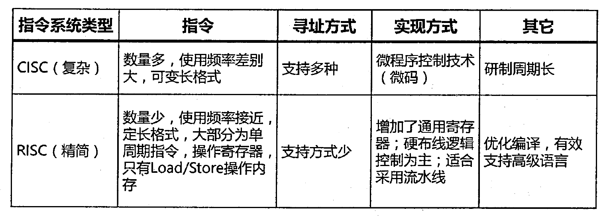

#### **CISC和RISC的区别**

- 前者更加专注于高性能但同时高功耗的实现（x86），而后者则专注于小尺寸低功耗领域（ARM）。

- 实际上也有很多事情CISC更加合适，而另外一些事情则是RISC更加合适，比如在执行**高密度的运算任务**的时候CISC就更具备优势，而在执行**简单重复劳动的时候RISC**就能占到上风。

## 四、流水线

> **流水线**，亦称**管线**，是现代计算机[处理器](https://zh.wikipedia.org/wiki/处理器)中必不可少的部分，是指将计算机[指令](https://zh.wikipedia.org/wiki/指令)处理过程拆分为多个步骤，并通过多个硬件处理单元并行执行来加快指令执行速度。其具体执行过程类似工厂中的流水线，并因此得名。 
>
> 如果作出类比，则计算机指令就是流水线传送带上的产品，各个硬件处理单元就是流水线旁的工人。

[计算机体系结构——流水线技术（Pipelining）](https://www.cnblogs.com/CorePower/p/CorePower.html)

### 4.1概念

> 流水线是指在程序执行时多条指令重叠进行操作的一种准并行处理实现技术。
>
> 各种部件同时处理是针对不同指令而言的，它们可同时为多条指令的不同部分进行工作，以提高各部件的利用率和指令的平均执行速度。

[深入浅出说流水线](https://www.kancloud.cn/digest/mybasic/217635)

#### MIPS的指令可以分成如下5个阶段：

1. 取指（IF）（Fetch）:：从存储器取指令，并更新PC
2. 译码（ID）（Decode）：指令译码，从寄存器堆读出寄存器的值
3. 执行（EX）（Execute）：运算指令：进行算术逻辑运算，访存指令：计算存储器的地址
4. 访存（MEM）（Memory）：Load指令：从存储器读指令，Store指令：将数据写入寄存器
5. 回写（WB）（Write Back）：将数据写入寄存器堆

#### 单周期与流水线的区别

- 实际上，流水线并不会缩短单条指令的执行时间（甚至会增加时间），而是**提高指令的吞吐率（单位时间进多少指令，有多少指令完成）**。

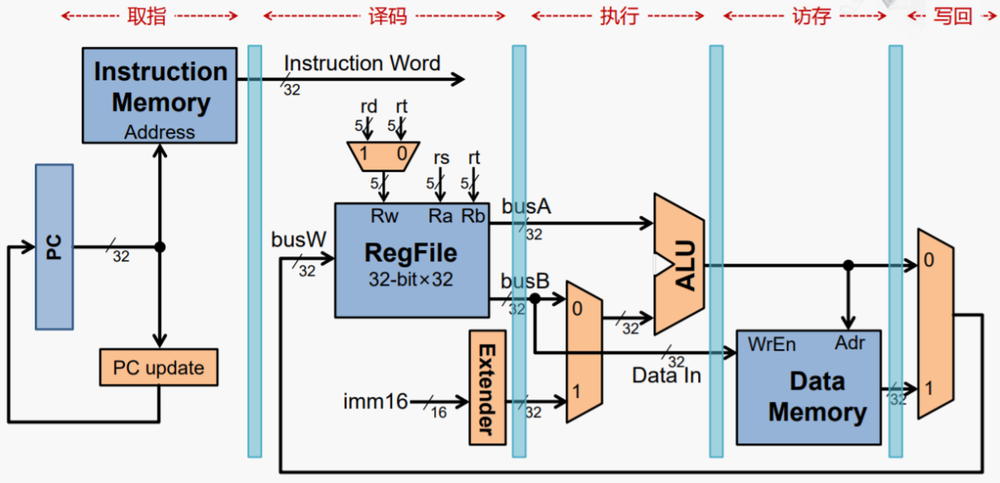

以下计算公式需要明确的是：

1. 方块标识的序号（1,2,3……）是不同的指令，单条指令可拆分为不同步骤。
2. 横坐标是时间轴。
3. 纵坐标是指令分步骤轴。
4. **理论公式计算时**：各指令分步骤不间断执行；**实践公式计算时**：各指令分步骤有间断执行。
5. **共同点**：不论是“理论”还是“实践”，计算公式里的流水线周期都是指：**分步骤用时最长的一段**
6. **不同点**：同一条指令的计算时间不同（有无间隔）

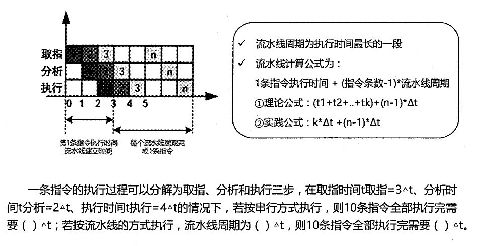

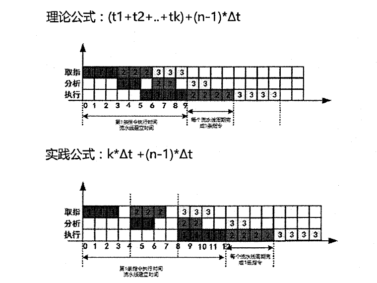

### 4.2计算

#### 超标量流水线

- [流水线、超流水线、超标量技术对比](https://blog.csdn.net/do2jiang/article/details/4545889)
  - 流水线技术是一种将每条指令分解为多步，并让各步操作重叠，从而实现几条指令并行处理的技术。
  - 超级流水线以增加流水线级数的方法来缩短机器周期，相同的时间内超级流水线执行了更多的机器指令。要提高时钟频率，一种可能的方法就是减小每个阶段的时间消耗。其中一种最简单的办法，就是将每个阶段再进行细分成更小的步骤，同样是细分后的每个阶 段，单个阶段的运算量小了，单位耗时s也就减少，这样实际上就是提高了时钟频率。
  - 超标量（superscalar）是指在CPU中有一条以上的流水线，并且每时钟周期内可以完成一条以上的指令，这种设计就叫超标量技术。 其实质是以空间换取时间。而超流水线是通过细化流水、提高主频，使得在一个机器周期内完成一个甚至多个操作，其实质是以时间换取空间。

超标量流水线，有几条流水线，就是有几**度**

- [计算例题](https://wenku.baidu.com/view/40b3a6e380c758f5f61fb7360b4c2e3f57272521.html)

  

#### 吞吐率计算

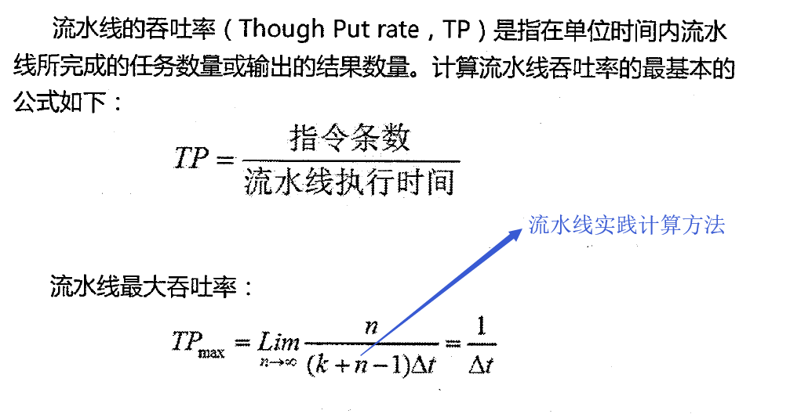

#### 加速比计算

## 五、层次化存储结构

- **前提条件**：在计算机中程序执行时所有的**指令和数据**都是从存储器中取出来**放到CPU中**执行的。**存储器的容量和性能**应当随着处理器的速度和性能的提高而通过提高，以保持系统性能的平衡。
- **困境**：然而在过去的 20 多年中，随着时间的推移，**处理器和存储器在性能发展上的差异越来越大**，存储器在容量尤其是访问延时方面的性能增长越来越跟不上处理器性能发展的需要。
- **解决方案**：为了缩小存储器和处理器两者之间在性能方面的差距，通常在计算机内部采用层次化的**存储器体系结构。**
- **概念**：计算机的三层存储系统体系，分别为：Cache(高速缓冲存储器)、主存（内存）、辅存（外存）。

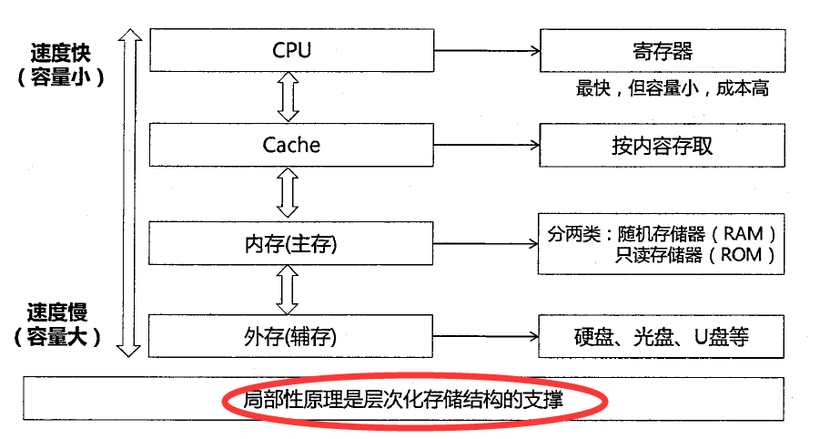

### 5.1 Cache

[Cache的基本概念与工作原理](http://www.360doc.com/content/19/0512/18/51999006_835226511.shtml)

#### 概念

- Cache 位于 CPU 和内存之间，可以节省 CPU 从外部存储器读取指令和数据的时间。
- **块**：为了方便 cache 和主存间交换信息，cache 和主存空间都被划分为相等的区域。例如将主存中一个 512 个字节的区域称作一个块（block）。
- **行**：cache 中存放一个主存块的区域称作行（line）。
- **cache 行有效位**：系统启动时，每个 cache 行都为空，其中的信息无效，只有 cache 行中装入了主存块之后才有效。为了说明 cache 行中的信息是否有效，某一个行都有一个**有效位**。
- **刷Cache**：通过将一行的有效位清零来淘汰这一行中所存储的主存快的操作称为冲刷。

##### 使用“Cache+主存储器”的系统平均周期

#### 局部性原理 

- 时间局部性：是指被访问的某个存储单元在一个**较短的时间间隔**很可能又被访问。
- 空间局部性：是指访问的某个存储单元的**临近单元**在一个**较短的时间间隔**内很可能也被访问。
- **工作集理论**：工作集是进程运行时被频繁访问的**页面**集合。

#### Cache页面淘汰

##### Cache页面淘汰算法

- 先进先出算法（FIFO）
  - 基本思想是：当需要淘汰一个页面时，总是选择驻留主存时间最长的页面进行淘汰，即先进入主存的页面先淘汰。
  - 理由是：最早调入主存的页面不再被使用的可能性最大。 
- 最近最久未使用算法（LRU，Least Recently Used）
  - 基本思想是：利用局部性原理，根据一个作业在执行过程中过去的页面访问历史来推测未来的行为。它认为过去一段时间里不曾被访问过的页面，在最近的将来可能也不会再被访问。所以，这种算法的实质是：当需要淘汰一个页面时，总是选择在**最近一段时间内最久不用**的页面予以淘汰。 

- 最近最少使用算法（LFU，Least Frequently Used）
  - 它是基于“如果一个数据在最近一段时间内**使用次数很少**，那么在将来一段时间内被使用的可能性也很小”的思路。

#### Cache的读写过程

##### 写

- 写直达：同时写Cache和内存
- 写回：只写Cache，淘汰页面时，写回内存
- 标记法：只写入内存，并将标志位清0，若用到此数据，需要再次调取

##### 读（映射规则：地址变换过程）

> cache 行中的信息取自主存中的某个块。将**主存块**复制到 cache 行时，主存块和 cache 行之间必须遵循一定的**映射规则**。这样 CPU 在要访问某个主存单元时，可以**依据映射规则到 cache 对应的行中查找要访问的信息**，而不用在整个 cache 中查找。
>
> - 主存单元到Cache单元的地址转换由硬件完成

- 直接相连映射（direct associate）：每个主存块映射到 cache 的固定行中。(硬件电路简单，但是冲突率很高)

- 全相连映射（full associate）：每个主存块映射到 cache 的任意行中。(电路复杂，适用于小容量的cache，冲突率较低)

- 组相连映射（set associate）：每个主存块映射到 cache 的固定组的任意行中。(折中)

### 5.2主存-编址

[二进制数与十六进制数之间如何互相转换](https://jingyan.baidu.com/article/47a29f24292608c0142399cb.html)

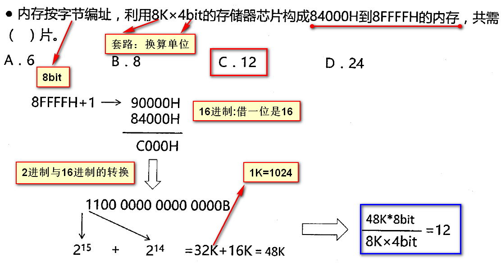

#### 磁盘结构与参数

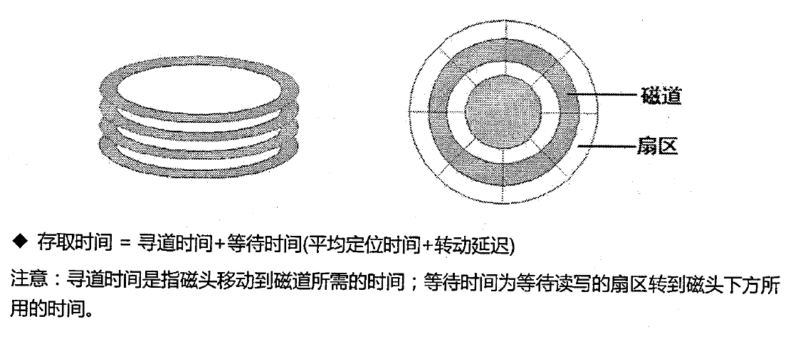

#### 总线

[漫谈计算机组成原理（二）系统总线](https://cloud.tencent.com/developer/article/1143618)

总线的传输方式

- 并行方式
- 串行方式

- 同一时刻一条总线仅允许一个设备发送，但允许多个设备接受

> 微机中的总线分为数据总线、地址总线和控制总线3类。不同型号的CPU芯片，其数据总线、地址总线和控制总线的条数可能不同。
>
> - **数据总线DB**用来传送数据信息，是**双向**的。CPU既可通过DB从内存或输入设备**读入数据**，又可通过DB将内部数据**送至内存或输出设备**。DB的宽度决定了CPU和计算机其他设备之间每次交换数据的位数。
> - **地址总线AB**用于传送CPU发出的地址信息，是**单向**的。传送地址信息的目的是指明与CPU交换信息的内存单元或I/O设备。存储器是按地址访问的，所以每个 存储单元都有一个固定地址，要访问1MB存储器中的任一单元，需要给出1M个地址，即需要20位地址（220=1M）。因此，**地址总线的宽度决定了CPU 的最大寻址能力**。
> - **控制总线CB**用来传送控制信号、时序信号和状态信息等。其中有的是CPU向内存或外部设备发出的信息，有的是内存或外部设备向CPU发出的信息。显然，**CB中的每一条线的信息传送方向是一定的、单向的，但作为一个整体则是双向的**。所以，在各种结构框图中，凡涉及到控制总线CB，均是以双向线表示。
>
> 补充
>
> - 扩展总线（Expansion Bus）：可连接扩展槽和电脑。
> - 局部总线（Local Bus）：取代更高速数据传输的扩展总线。
>
> 总线的性能直接影响到整机系统的性能，而且任何系统的研制和外围模块的开发都必须依从所采用的总线规范。总线技术随着微机结构的改进而不断发展与完善。

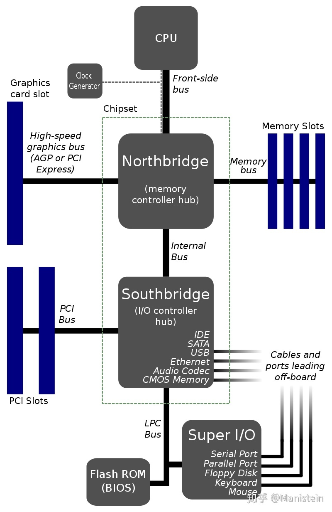

#### 校验码

校验码初体验：[干货丨身份证号码编码规则及其应用](http://www.woshipm.com/pmd/350196.html)

- 奇偶：[校验码 -> 奇偶校验](https://blog.csdn.net/FeeLang/article/details/25887225)

- 海明校验码：[校验码——揭开海明校验码求解之谜](https://blog.csdn.net/xingyu0806/article/details/48765855)
  - 海明校验的基本思想：将有效信息按某种规律分成若干组，每组安排一个校验位，做奇偶测试，就能提供多位检错信息，以指出最大可能是哪位出错，从而将其纠正。实质上，**海明校验是一种多重校验。**
  - 海明校验的特点：不仅具有**检测错误的能力**，同时还具有**给出错误所在准确位置的能力**。
- 循环冗余校验码[（CRC）计算及校验原理的最通俗诠释](https://www.cnblogs.com/liushui-sky/p/9962123.html)
  - 补充：[CRC（循环冗余校验码）简介与实现解析](https://zhuanlan.zhihu.com/p/61636624)

## 六、系统可靠性分析

### 6.1可靠性指标

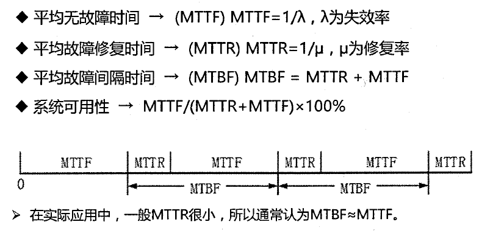

### 6.2串联系统与并联系统

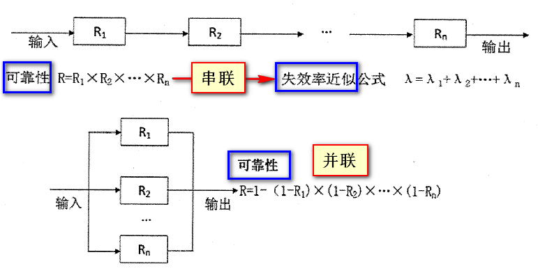

### 6.3模冗余系统与混合系统

